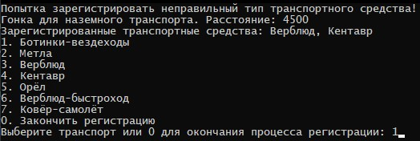
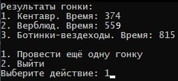
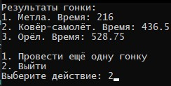

# Курсовой проект «Симулятор гонок»

Курсовой проект — простейшая реализация симулятора гонок для фэнтезийных транспортных средств (ТС).

## Содержание

### 1. Правила игры
Все ТС делятся на два типа:
 - наземные;
 - воздушные.
 
В симуляторе есть несколько видов ТС:
 - верблюд (наземное);
 - верблюд-быстроход (наземное);
 - кентавр (наземное);
 - ботинки-вездеходы (наземное);
 - ковёр-самолёт (воздушное);
 - орёл (воздушное);
 - метла (воздушное).

У всех ТС есть заранее заданная скорость.

В симуляторе есть несколько видов гонок:
 - только для наземных ТС;
 - только для воздушных ТС;
 - для наземных и воздушных ТС.

#### Наземные ТС
Наземные ТС не могут двигаться непрерывно: после определённого времени им нужно отдыхать. У каждого вида наземного ТС время движения своё. Время отдыха у каждого наземного ТС также различается и зависит от того, какая по счёту эта остановка.

##### Пример 
Скорость ТС равна 100 км/ч, дистанция равна 1000 км, время движения до отдыха равно 6 ч, длительность отдыха равна 3 ч. В таком случае ТС пройдёт дистанцию за 1000 / 100 = 10 ч. Так как время движения до отдыха равно 6 часов, то по пути ТС нужно будет отдохнуть 1 раз. Итоговое время составит: 10 + 3 = 13 ч.

Сводная таблица характеристик для каждого наземного ТС:

| Вид ТС           | Скорость | Время движения до отдыха| Длительность отдыха
|------------------|----------|----------------------------|--------------------
| Верблюд          | 10       | 30                         | Первый раз: 5 Все последующие разы: 8
| Верблюд-быстроход| 40       | 10                         | Первый раз: 5 Второй раз: 6.5 Все последующие разы: 8
| Кентавр          | 15       | 8                          | Всегда 2
| Ботинки-вездеходы| 6        | 60                         | Первый раз: 10 Все последующие разы: 5

#### Воздушные ТС
Воздушные ТС двигаются непрерывно. Так как они могут облетать препятствия, каждое воздушное ТС имеет собственный коэффициент сокращения расстояния: то есть для каждого воздушного ТС дистанция, которую нужно пройти, уменьшается. Коэффициент сокращения расстояния может зависеть от дистанции.

##### Пример 
Если у воздушного ТС коэффициент сокращения расстояния равен 5%, то вместо дистанции в 1000 км ему нужно пройти дистанцию в 1000 * 0.95 = 950 км.

Сводная таблица характеристик для каждого воздушного ТС:

| Вид ТС           | Скорость | Коэффициент сокращения расстояния
|------------------|----------|----------------------------------
| Ковёр-самолёт    | 10       | Если расстояние меньше 1000 — без сокращения Если расстояние меньше 5000 — 3% Если расстояние меньше 10000 — 10% Если расстояние больше или равно 10000 — 5%
| Орёл             | 8        | Всегда 6%
| Метла            | 20       | Увеличивается на 1% за каждую 1000 у.е. расстояния Например, для расстояния 5600 коэффициент будет 5%

### 2. Требования к решению

Требования по функционированию программы:
1. При старте программы пользователю должен быть предложен выбор типа гонки.
2. После выбора типа гонки пользователь должен указать расстояние для этой гонки.
3. Пользователю должна быть предоставлена возможность зарегистрировать ТС на гонку.
4. Можно регистрировать не более одного экземпляра для каждого вида ТС.
5. На гонку должно быть зарегистрировано хотя бы два вида ТС.
6. Нельзя зарегистрировать на наземную гонку воздушное ТС, а на воздушную гонку наземное ТС.
7. После завершения регистрации пользователь может либо зарегистрировать ещё ТС, либо начать гонку.
8. Сама гонка происходит мгновенно. Пользователю выводится результат гонки — ТС-участники гонки и их время.
9. Результаты участников должны выводиться по возрастанию времени: самый быстрый оказывается вверху списка, самый медленный — внизу.
10. Вместе с результатами гонки пользователю должен быть предложен выбор: провести ещё одну гонку (программа стартует заново) или выйти из программы.

Требования к структуре и реализации программы:
1. Для реализации ТС и гонок должны быть использованы иерархии классов.
2. Для каждого класса должна быть создана пара «заголовочный файл + файл исходного кода».
3. Классы ТС, гонок и другие вспомогательные классы должны находиться в отдельной динамической библиотеке (DLL).
4. В основном проекте (.exe) должен находиться код для взаимодействия с пользователем и использование классов из вашей библиотеки в ответ на действия пользователя.
5. Классы библиотеки не должны самостоятельно выводить данные на консоль.

### 3. Пример пошаговой работы программы

